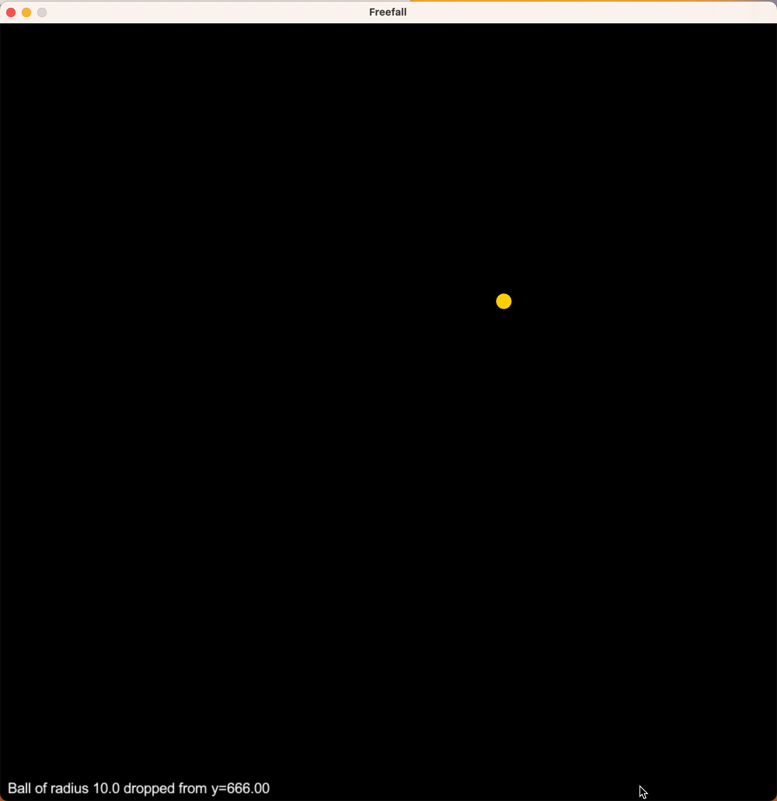
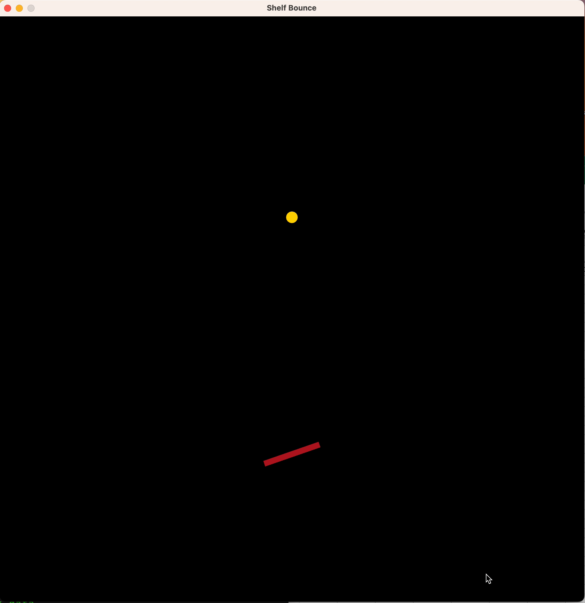
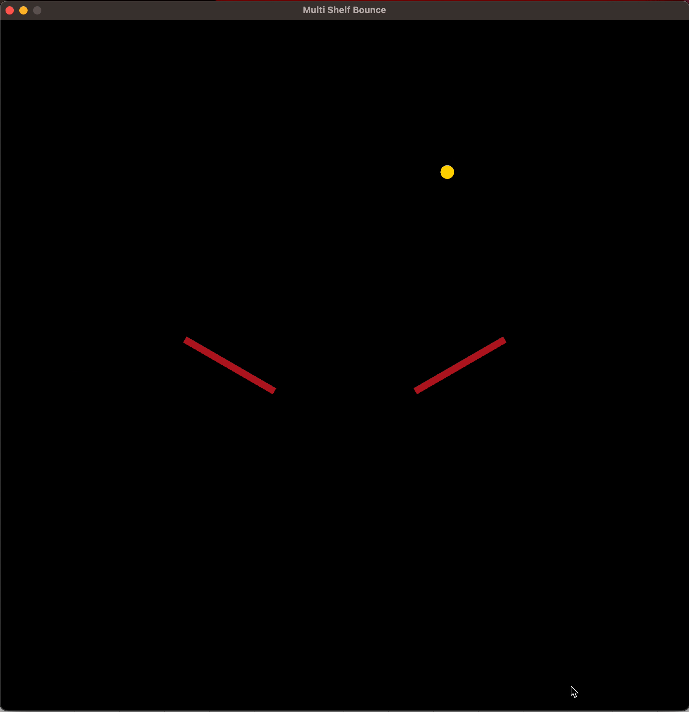

[](https://github.com/psf/black)

# Individual Project Submission

## Can Large Language Models learn physical models?
This repository contains the code for the individual project submission MSc in Artificial Intelligence Course at Imperial College London.
The project was supervised by [Dr Edward Johns](https://www.imperial.ac.uk/people/e.johns). It investigates the architecture of the Transformer Model and attempts to perform supervised learning and physical scenarios in simulation.


[//]: # (# Project Name)

[//]: # ()
[//]: # ([![Build Status]&#40;link-to-build-status-badge&#41;]&#40;link-to-build-status&#41;)

[//]: # ([![License]&#40;link-to-license-badge&#41;]&#40;link-to-license&#41;)

###  Project Description

This projects evaluates the ability of the LLM architecture to perform regression analysis using text data from simulated physical scenarios. It makes use of scene descriptions (in text format) of physical scenarios and attempts to predict the next state of the system. In particular, the project investigates the ability of the LLM to learn the following physical models:
- [x] Free Fall under gravity
- [x] Single Object Collision
- [x] Double Object Collision

With variations in objects' positions, orientations and time over which the observation is made.

These scenarios are simulated using the [Arcade library](https://api.arcade.academy/en/latest/) and with a physics engine based in [Pymunk](https://www.pymunk.org/en/latest/). The LLM is trained on the text descriptions of the scenarios and the next state of the system is predicted. The predicted state is then compared to the actual state of the system. The LLM is trained using the [HuggingFace](https://huggingface.co/) library. There is also an exploration of In-Context Learning. This is carried out on on GPT-3 using [OpenAI's](https://openai.com/) API.


The repository amalgamates three repositories which I have worked on for the different parts of the project. While these repositories are not linked, sections of the code have been used in this project. The repositories are:

[//]: # (- **[transformer_from_scratch]&#40;https://github.com/Uokoroafor/transformer_from_scratch&#41;**: An implementation of the Transformer architecture from scratch in PyTorch from the paper&#40;[Attention Is All You Need]&#40;https://arxiv.org/abs/1706.03762&#41;&#41;.)
- **[gpt_from_scratch](https://github.com/Uokoroafor/gpt_from_scratch)**: An implementation of a smaller version of the GPT model from the paper([Language Models are Unsupervised Multitask Learners](https://d4mucfpksywv.cloudfront.net/better-language-models/language-models.pdf)) in PyTorch.
- **[finetune_llms](https://github.com/Uokoroafor/finetune_llms)**: A sandbox repository that contains code for fine-tuning and performing In Context Learning on the LLMs.
- **[robotics_environment](https://github.com/Uokoroafor/robotics_environment)**: A sandbox repository that contains code for the simulation of the physical scenarios in arcade and pymunk.

## Table of Contents
- [Individual Project Submission](#individual-project-submission)
  - [Can Large Language Models learn physical models?](#can-large-language-models-learn-physical-models)
    - [Project Description](#project-description)
  - [Table of Contents](#table-of-contents)
  - [Getting Started](#getting-started)
  - [Features](#features)
  - [The Physical Scenarios](#the-physical-scenarios)
    - [Free Fall](#free-fall)
    - [Shelf Bounce](#shelf-bounce)
    - [Multi Shelf Bounce](#multi-shelf-bounce)
  - [Usage](#usage)
    - [Rending an Environment](#rending-an-environment)
    - [Generating Datasets](#generating-datasets)
  - [Training the LLMs](#training-the-llms)
  - [Structure](#structure)
  - [References](#references)
  - [License](#license)

## Getting Started
```
git clone https://github.com/Uokoroafor/individual_project_submission.git
cd individual_project_submission
pip install -r requirements.txt
```
## Features
- [x] Models
  - [x] Implementation of GPT from scratch [link](./models/gpt/models/gpt_transformer.py)
  - [x] Implementation of an Encoder Only Transformer from Scratch which allows text, numerical or categorical output [link](./models/gpt/models/eo_transformer.py)
  - [x] A customisable Standard Neural Network [link](./models/nn_models/nn_model.py)
- [x] Environments
  - [x] Environment Abstract Class [link](./environments/environment.py)
  - [x] Object used in Environments [link](./environments/objects.py)
  - [x] Render Constants [link](./environments/render_constants.py)
- [x] Environment Generators
  - [x] Free Fall - Defined [link](./generated_environments/freefall/freefall.py)
  - [x] Single Object Collision - Defined in [link](./generated_environments/shelf_bounce/shelf_bounce.py)
  - [x] Double Object Collision - Defined in [link](./generated_environments/multi_shelf_bounce/multi_shelf_bounce.py)
- [x] Utils
  - [x] Training Utils which handle training runs including Trainer classes [link](./utils/train_utils.py)
  - [x] File Utils which handle file operations [link](./utils/file_utils.py)
  - [x] Plotting Utils which handle plotting training run results [link](./utils/plot_utils.py)
  - [x] Logging Utils which handle logging training run results [link](./utils/logging_utils.py)
  - [x] Data Utils creates data handlers and dataloaders for training [link](./utils/data_utils.py)
  - [x] Physical Dataset which is made solely to train the Neural Network on numerical data [link](./utils/physical_dataset.py)
  - [x] Timing Utils which time training runs [link](./utils/time_utils.py)
  - [x] In Context Learning Utils [link](./utils/in_context_learning_utils.py)
  - [x] Fine Tuning Utils [link](./utils/finetune_utils.py)
  - [x] Environment Generation Utils - Defined in [link](./utils/env_utils.py)
  - [x] Byte Pair Encoding (BPE)
    - [x] BPE Tokeniser and Encoder implemented from scratch [link](./utils/bpe.py)] 
    - [x] Basic Tokeniser and Encoder implemented from scratch [link](./utils/basic_tokeniser.py)

## The Physical Scenarios
### Free Fall
A ball is dropped from a fixed height and its y-position after a set time is noted in a numerical and text log. 
 A sample prompt from the text log is shown below:
```
Ball of radius 10.0 dropped from y=664.87 At time 16.2 ans: Ball is at y=12.82
```


### Shelf Bounce
A ball is dropped from a fixed height and bounces off an angled shelf. The ball's y-position after a set time is noted in a numerical and text log. 
 A sample prompt is shown below:
```
Shelf of width 100.0 and angle -11.5 degrees at x=500.0 y=477.17 
Ball of radius 10 and elasticity 0.5 is dropped from x=500 and y=784.94 
At time 20.0 Ball is at x=574.21 ans: y=525.22
```



### Multi Shelf Bounce
A ball is dropped from a fixed height above multiple angled shelves. The ball's y-position after a set time is noted in a numerical and text log. 
 A sample prompt is shown below:
```
Shelf of width 100.0 and angle -11.5 degrees at x=500.0 y=477.17 
Ball of radius 10 and elasticity 0.5 is dropped from x=500 and y=784.94 
At time 20.0 Ball is at x=574.21 ans: y=525.22
```



## Usage
### Rending an Environment
```python
import random

from environments.render_constants import SCREEN_HEIGHT as HEIGHT
from generated_environments.freefall.freefall import FreefallEnv

# Set render = True for visual rendering
time_limit = round(random.uniform(1, 10), 2)
env = FreefallEnv(render=False, time_limit=time_limit, fixed_height=True, drop_height=HEIGHT // 2)
# Set render to True for visual rendering
print(env.numerical_log) # prints the numerical log of the scenario
print(env.text_log) # prints the text log of the scenario
```

### Generating Datasets
The repo has included a sample of the data from each environment in the data folder.  The data is generated using the Arcade library and Pymunk. The original data was generated with a training set size of 200,000 which is split into 80/10/10 and an out-of-sample test set of 40,000.
This took a very long time to generate, and too large for the repo. A required dataset can be generated for testing purposes by following the instructions below.
To generate the data, you can do one of the following:
- To generate all the data in one fell swoop:
  - Update the required number of samples in gen_examples.py file
  - Run the following bash script:
    ```bash
    ./generate_data.sh
    ```
- To generate the data for each environment individually:
  - Update the required number of samples in gen_examples.py file
  - Run the following python scripts for the required environment:
    - Free Fall
      ```bash
      python freefall_generator.py
      python freefall_data_prep.py
      ```
    - Shelf Bounce
      ```bash
      python shelf_bounce_generator.py
      python shelf_bounce_data_prep.py
      ```
    - Multi Shelf Bounce
      ```bash
      python multi_shelf_bounce_generator.py
      python multi_shelf_bounce_data_prep.py
      ```
## Training the LLMs
There is sample script for training the LLMs from scratch in the root directory. It is for training a Numerical LLM on the Free Fall environment. The script can be modified to train the LLMs on the other environments. 
- The file is called train_structure_file.py
- The training parameters are defined in the config file called config_structure.txt
- The training data is defined in the data folder
- A training folder will be created by the logger which will store the following:
  - training results
  - model architecture
  - training hyperparameters
  - plots
  - saved models

Scripts for some of the experiments run are in the experiments folder.
## Structure
The repository is structured as follows with the main files in the root directory. Below is a verbose summary of the repository structure. It would be best to explore the repository to get a better understanding of the structure.
```
├── README.md
├── environment_renderings
│   ├── freefall.gif
│   ├── multi_shelf_bounce.gif
│   └── shelf_bounce.gif
├── environments
│   ├── environment.py
│   ├── objects.py
│   └── render_constants.py
├── generated_environments
│   ├── freefall
│   │   ├── freefall.py
│   │   └── freefall_render.py
│   ├── multi_shelf_bounce
│   │   └── multi_shelf_bounce.py
│   └── shelf_bounce
│       └── shelf_bounce.py
├── models
│   ├── gpt
│   │   ├── blocks
│   │   │   ├── decoder_block.py
│   │   │   ├── encoder_block.py
│   │   │   └── positional_encoding.py
│   │   ├──  embeddings
│   │   │   ├── positional_encoding.py
│   │   │   ├── token_embedding.py
│   │   │   └── token_positional.py
│   │   ├── layers
│   │   │   ├── attention.py
│   │   │   ├── causal_self_attention.py
│   │   │   ├── feed_forward.py
│   │   │   ├── layer_norm.py
│   │   │   └── self_attention.py
│   │   ├── models
│   │   │   ├── eo_transformer.py
│   │   │   └── gpt_transformer.py
│   └── nn_models
│       └── nn_model.py
├── utils
│   ├── bpe.py
│   ├── data_utils.py
│   ├── file_utils.py
│   ├── in_context_learning_utils.py
│   ├── logging_utils.py
│   ├── plot_utils.py
│   ├── text_utils.py
│   └── train_utils.py
├── data
│   ├── freefall
│   ├── multi_shelf_bounce
│   └── shelf_bounce
├── experiments
│   ├── cross_train_experiments
│   ├── fine_tune_experiments
│   ├── icl_experiments
│   ├── interpolation_experiments
│   └── training_scripts
└── requirements.txt
```
## Contact
If you have any questions, suggestions, or comments, please raise an issue in the repository and I'll be happy to discuss.

## References
- [Attention Is All You Need](https://arxiv.org/abs/1706.03762)
- [Andrej Karpathy's github repo](https://github.com/karpathy)

## License
[](https://opensource.org/licenses/MIT)